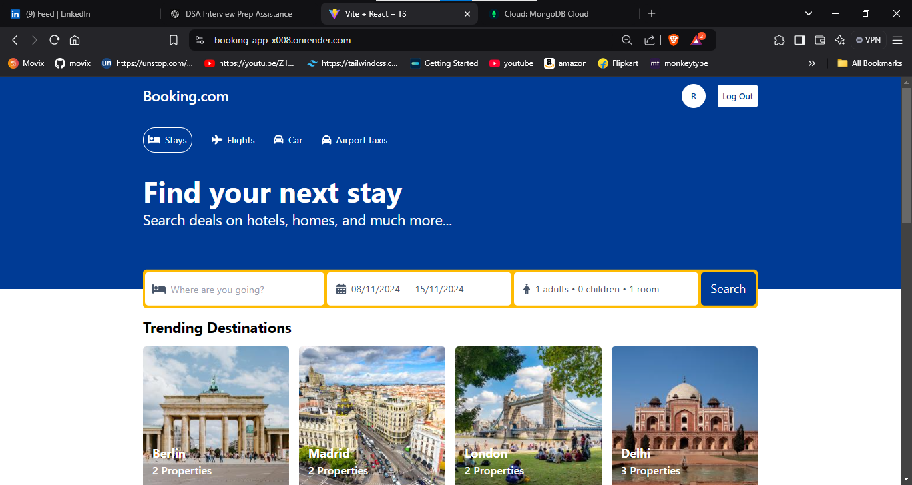
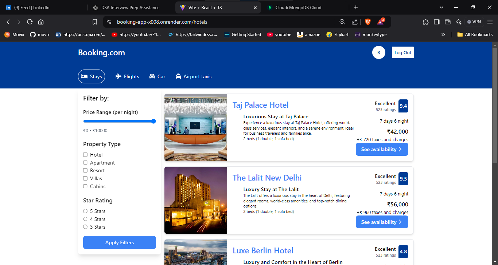
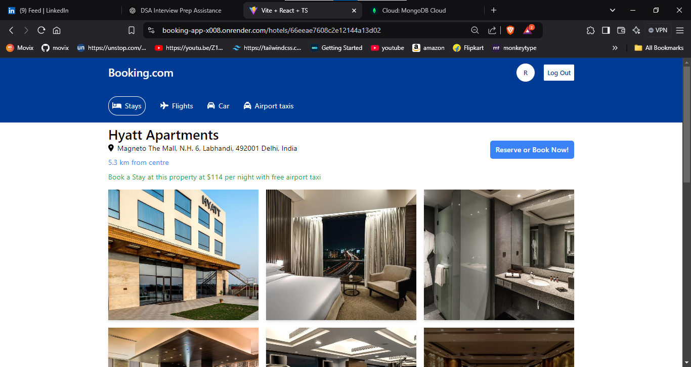
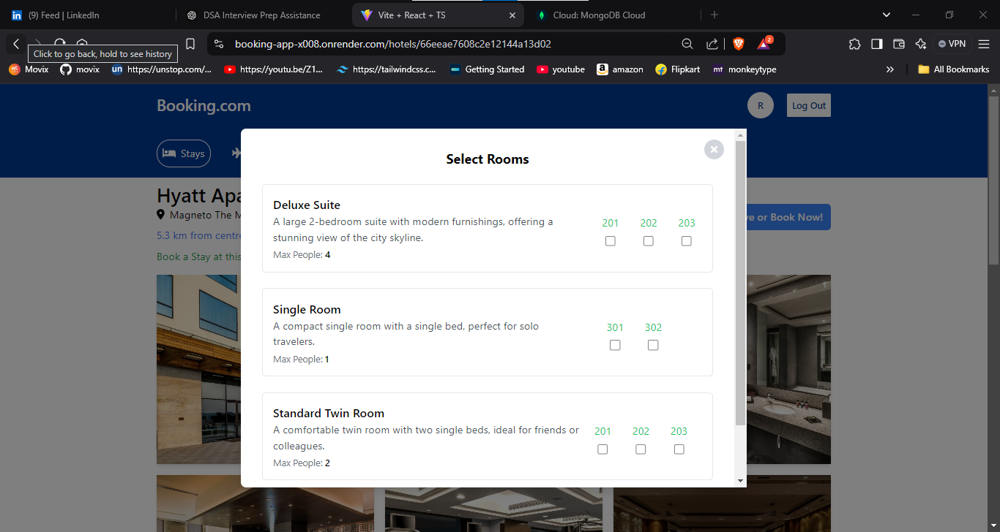

# Booking.com Clone

A full-stack web application inspired by [Booking.com](https://www.booking.com), designed to allow users to browse, filter, and book properties with an intuitive and responsive UI. This project includes secure user authentication, real-time property booking, and availability management.

## 📸 Screenshots

### Home Page

### Property Search and Filters

### Property Details and Booking

### Property Booking

## 🚀 Live Demo
You can access a live demo of the project [here]([https://your-demo-link.com](https://booking-app-x008.onrender.com/)).

## 🌟 Features

- **Property Listings & Search Filters**: Allows users to explore a wide range of properties with customizable search filters.
- **User Authentication**: Implements secure user registration and login, with role-based access controls.
- **Real-time Property Booking**: Users can book properties with dates immediately saved and updated in real-time.
- **Property Availability Management**: Tracks and marks booked dates, preventing double bookings and ensuring accurate availability status.

## 🔧 Tech Stack

- **Frontend**: React, TailwindCSS, Swiper.js for carousels
- **Backend**: Node.js, Express
- **Database**: MongoDB
- **Authentication**: JSON Web Tokens (JWT) with secure, HTTP-only cookies
